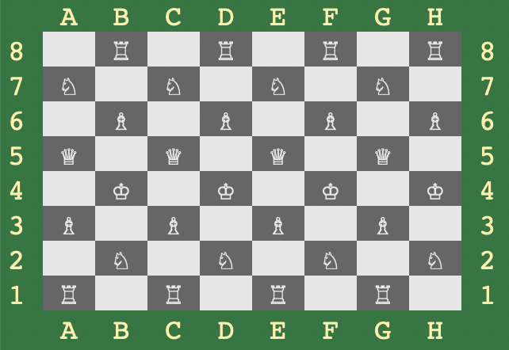

# 376_W23_CPP_Basics

>**Note:** Everything you program must be named *exactly* as written here.   

Time to learn the basics of C++.  

Start with this sample code:

```C++
#include <iostream>
#include <vector>

class Matrix {
private:
    std::vector<std::vector<int> > data;

public:
    // Constructor
    Matrix(int rows, int cols) : data(rows, std::vector<int>(cols, 0)) {}

    // Double parentheses overload
    int& operator()(int row, int col) {
        return data[row][col];
    }
};

int main() {
    Matrix matrix(3, 4);
    matrix(0, 0) = 1;
    matrix(1, 2) = 5;

    std::cout << matrix(0, 0) << std::endl; // Output: 1
    std::cout << matrix(1, 2) << std::endl; // Output: 5

    return 0;
}
```

Understand **every line of it**.  Write down your questions and bring them to me if you don't get any of it.  If I ask you which part you don't understand, DON'T TELL ME YOU DON'T UNDERSTAND ANY OF IT.  You have the Internet, ChatGPT (yes you can use it on *this* assignment), and other people to consult with.  Come to me with what you have tried and why that didn't work.

This simple assignment requires you to do the following:

1.  Create a Chessboard class.  Break it into two files - ```chessboard.h``` for the header and ```chessboard.cpp``` for the source.  It should hold a multidimensional ```vector``` (an 8x8).

2.  Override the parentheses operator ```operator()``` so that it takes a row and column

3.  Overload the ```ostream``` operator to print out a chessboard.  You will need to read documentation on this.  Notice that ```ostream``` is not a method that goes in a class, but rather the global namespace (Why?).  You should print the board so that it looks like this (this is a sample; print yours with pieces wherever they are on the board):



4.  Overload the ```operator<``` so that it compares two instances of Chessboard and determines which one is bigger.  A "bigger" chess board is one that has more black pieces than white pieces.


